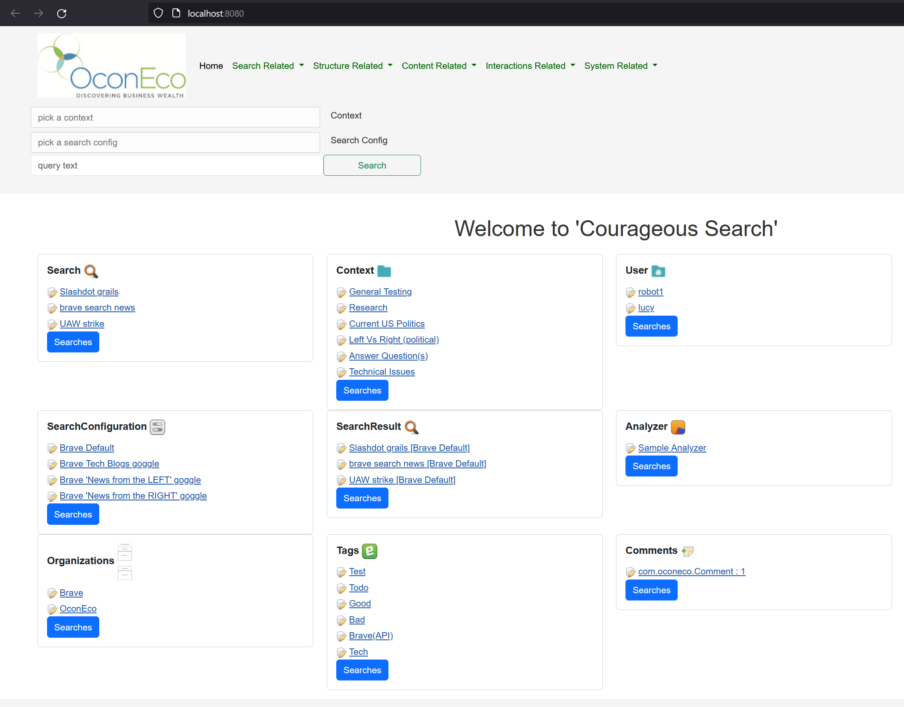
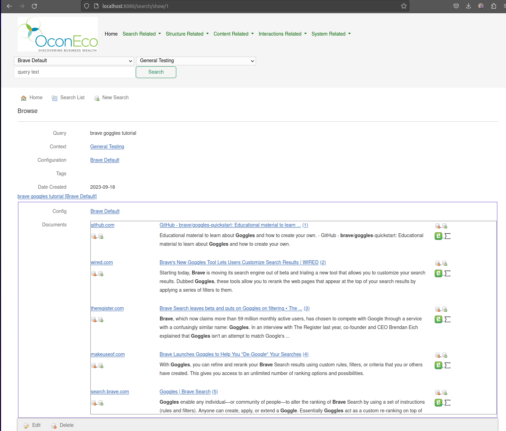
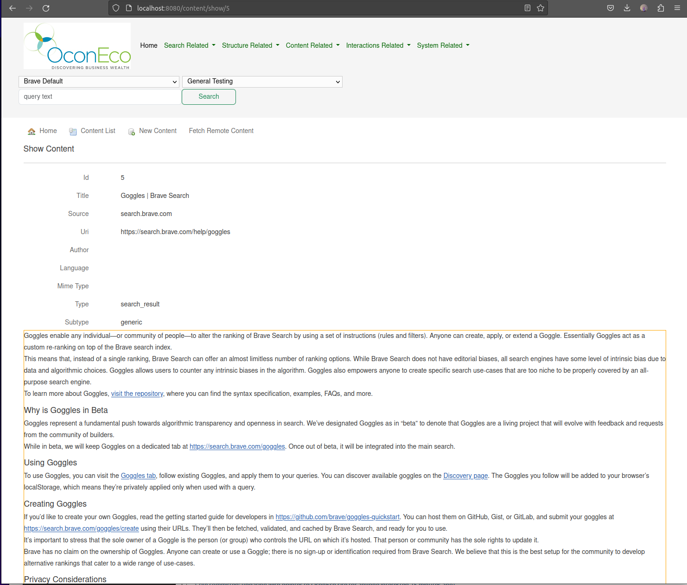

# Overview of CourageousSearch (CS)
### Own Your Own Search!
- **What** you search: Search Engines
- **How** you search: Boosting/Filtering, tweaking
- **Why** you search: Contexts/Intents
- **Annotate** Results: boost/bury/tag/comment/... 
- **Analyze** Results: Shared & Customizable Analysis
- **Collaborate**: Share as much as you like
 

## What you search
  - Brave Search [API](https://brave.com/search/api/)
    - start with system default API account
    - upgrade to user/specific API account when ready _(i.e. request limits)_
  - Solr deployment/collections
    - e.g. [SolrSystem](https://github.com/seanoc5/solr-system)
  - various other sources depending on extending/customizing elements of CS 
    - [Marginalilia](https://search.marginalia.nu/) _(coming soon...?)_
      - [self hosted](https://github.com/MarginaliaSearch/MarginaliaSearch)
    - Lucidworks [Fusion](https://lucidworks.com/fusion-platform/)
    - AWS [OpenSearch](https://aws.amazon.com/opensearch-service/) service  
    - SERPs...?
    - internal/custom search engines

## How you search
- Control sites/sources
  - boost and bury or hide/block various sites 
    - rely on crowdsourcing to start...
    - customize your preferences if/when necessary (e.g. [Brave Goggles](https://github.com/brave/goggles-quickstart/blob/main/README.md)) 
- Add enhanced **result** analysis & filtering
  - add custom/personalized boosting
  - filter/boost sites, authors, documents, content
    - based on system/communal preferences initially 
    - optionally switch to more bespoke filtering/boosting/analyzing 

## Why you search: Search Contexts/Intents
- What is a CS Context? 
  - Contexts are user-defined grouping of search actions, i.e. search intent or goal
  - CS starts with a shared foundation of common search contexts
  - users are able to add custom search contexts (shared, or private)
- What is the Benefit?
  - Using search Contexts can help the system provide shared and/or personalized boosts, analysis, and other **improvements in results**.
  - For the truly adventurous: Contexts help improve machine learning and model building
    - both self-hosted AND OconEco-hosted CourageousSearch encourage users to access/export any and all of their data and perform analysis outside CS when desired.

## Annotate Results: for Memory and Learning
- Most parts of CS have multiple possible annotations
  - Contexts, Searches, Sources/Sites
  - Results Docs/Content, Content Fragments (e.g. paragraphs) 

## Analyze Results: Shared & Customizable Analysis
- CS has several analysis "agents" built-in
  - _coming soon..._
  - e.g.: 
    - detect author/publisher,
    - detect content date
    - apply machine learning (SparkNLP) pipelines to result document, augmenting stored results/content
    - auto-tag result docs
    - ...
- Create/use bespoke analysis agents as desired
  - users can create private or shared custom analysis agents

## Collaborate: Share as much as you like
- Common elements to share:
  - Contexts, and related: 
    - searches, results, annotations
  - Analysis agents
    - simple regex/term matching/boosting
    - more advanced NLP/NLU matching/boosting
- "Offline" deep analysis
  - Machine learning
  - Model building/deployment

 

## Getting Started
- Request a hosted account via [project issue](https://github.com/seanoc5/courageoussearch/labels/account)
  - note hosted accounts are currently (Feb 2024) very limited
  - more available hosted accounts will be coming in the near/medium future _(driven by demand/interest)_

or 

- Go to [README.Deployment.md](README.Deployment.md) and host your own search

## More information
For now the functionality is very basic, but perhaps interesting:
- Use Brave Search API to:
  - send searches
  - retrieve source webpage content in addition to Brave's summary
- Allow for setting `SearchConfig`
  - currently only tested with Brave, but should be extensible
  - quite useful for [Brave Goggles](https://github.com/brave/goggles-quickstart) 
- Allow for setting `Context`
  - for use in future _Personal_ ML and result analysis
  - potentially also modify search parameters for a 'session' (aka context/intent/goal)

I stumbled across the `Brave` browser, and then continued blindly to discover the Brave API _(which I really like)_. 
Things got more interesting for me when I found the `Goggles` beta functionality. 

Two of the public Goggles are [News from the Left](https://raw.githubusercontent.com/allsides-news/brave-goggles/main/left.goggles) and [News from the Right](https://raw.githubusercontent.com/allsides-news/brave-goggles/main/right.goggles). 
My intent with `CourageousSearch` _(as opensource work)_ is to allow adventurous and technically-oriented users to have a tool that can help compare multiple "sources"
in a convenience and semi-objective manner. _(More on that later)_  

**Full Disclosure:** 
I am developing a larger, more involved project that builds upon these basics. That will focus on Enterprise interests, 
and bridging the "gap" between semantic search _(ala ChatGPT etc)_ and keyword search _(mostly Solr, which I am more familiar with)_.  
I (currently) intend to keep the Enterprise-oriented project proprietary. It is still just a vague thought, and does not even have a working name at the moment.

I also hope to find a few spare hours to document where I have implemented Grails-thingies and provide pointers to examples. I expect that the majority of people using Grails already know these things, and therefor these 'pointers' may not be of much use. If you are interested, please feel free to contact me on this github project and let me know what you are interested in. No promises, but I do welcome the chance to help give back a bit if I can.

For anyone interested, [OconEco](http://www.oconeco.com) is the start-up that has been primarily focused on economics. 
I am involved with the goal of improving stakeholder engagement and lowering the cost of decision making. More on that elsewhere...   

### Description:

`SearchConfigurations` roughly align to a specific search engine with a given (or default) set of parameters/setup. Please note that the initial configurations need valid Brave Search API tokens.
See: https://api.search.brave.com/login

A `Search` is tpyically a specific search (user, or system generated)
It will use a sepcific Search Tempalte or use the "default"
The Template can have multiple configs (search multiple engines or engine configs)

The `SearchConfig` will handle performing the relevant search,
as well as _converting the results into proper persistence objects_ (search results & docs, but possibly also Solr results docs)

## outline

- Search
  - SearchConfiguration 
  - SearchResults+
    - SearchConfiguration{1}
    - Document+

## Screenshots
Example of the dashboard:

Example of a SearchResults page showing Brave `description` snippets:

Example of a single result (aka `Content`, or document) with `structuredContent` which is the result of [Readability4j](https://github.com/dankito/Readability4J) parsing.
Note: this is still a beta implementation on my part--more to come...

### Todo
- implement reasonable tagging/commenting etc
  - upvote/downvote sites, docs, searchResults,...
  - allow users (and analyzer-bots) to assign tags and topics to various things
- Fix ugly/bad UI
  - Proper approach for searchConfig setup and tokens
  - Better handling of picking contexts and configs
  - Better UI/UX in general
- views-json: apply plugin:"org.grails.plugins.json-views
  - build script dependencies:  classpath "org.grails.plugins.views-gradle:1.0.1"  _(or higher version)_
-Add `Analysis` functionality
  - e.g. rerank results based on personal preferences
  - NLP and other advanced ML analysis
    - sentence classifier to highlight questions, answers, interesting things, and fluff... (still very vague)
  - assess/rank the result set in general (not sure how or why yet, but seems interesting)
- Add searchConfig to process solr results
  - Specifically connecto to a [Solr-System](https://github.com/seanoc5/solr-system) solr instance contain local/personal crawled info
- migrate to Micronaut

# other & misc
See Readme.Developer.md if you have interest in the code, grails, etc
