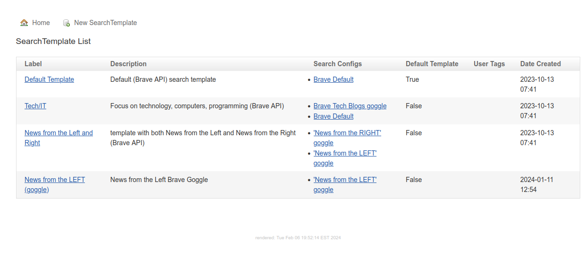
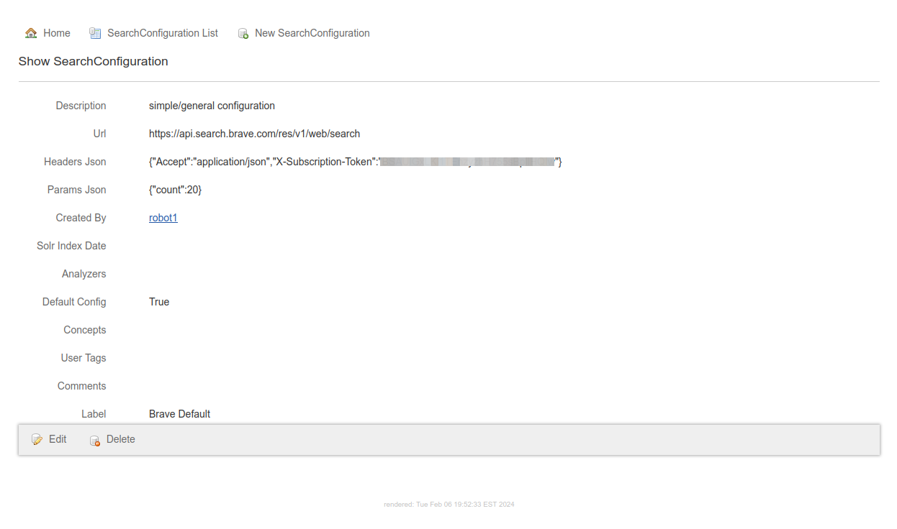
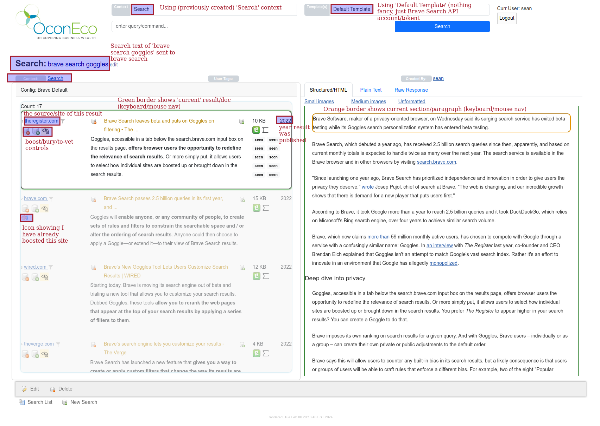
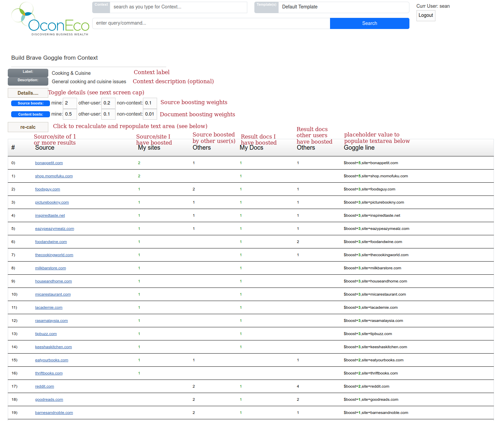
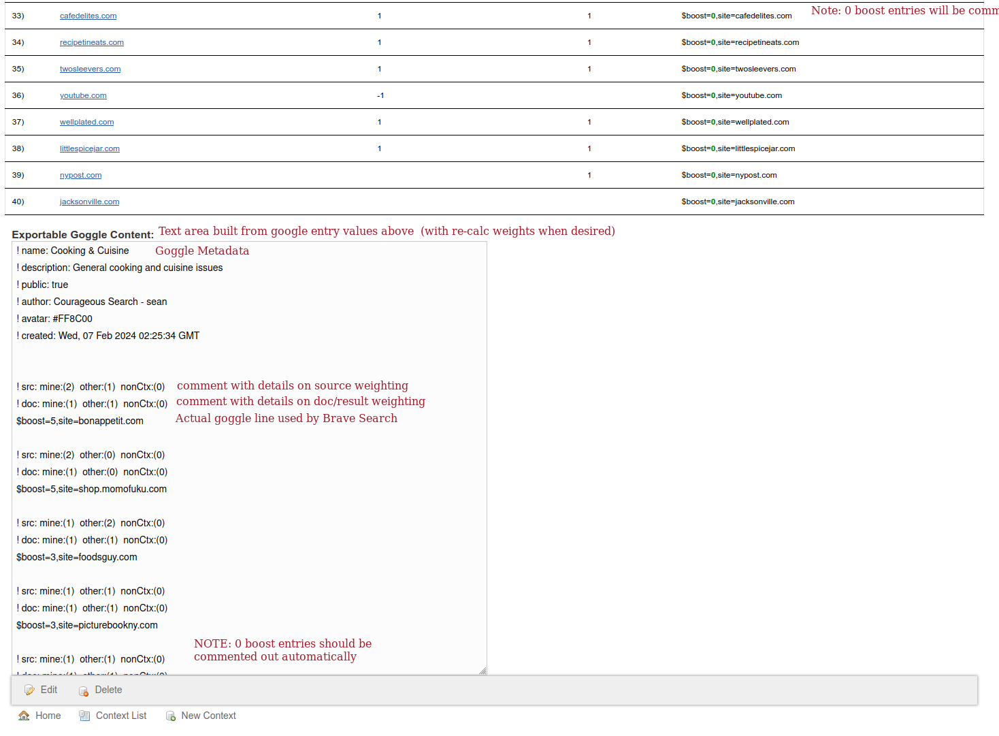
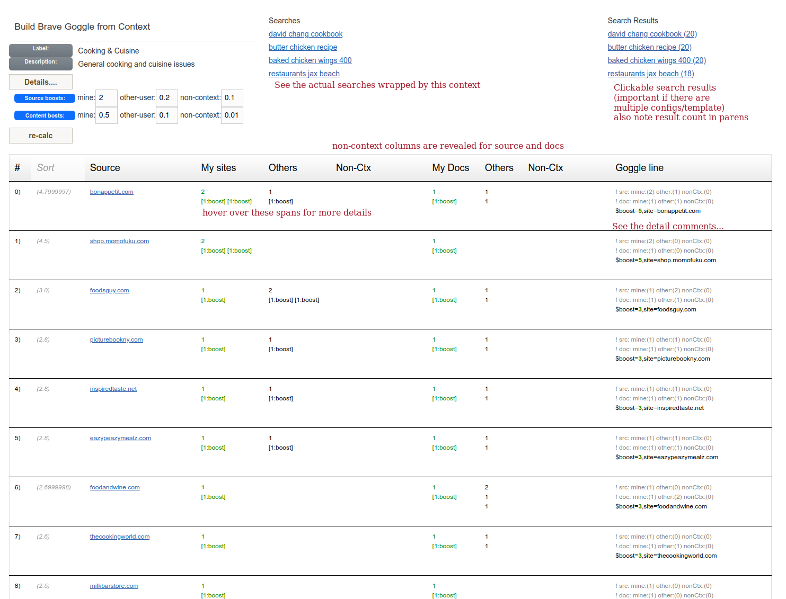

# Overview of building Brave Goggles with CourageousSearch (CS) Contexts
[Brave Search API](https://api.search.brave.com/app/documentation/web-search/get-started) has beta functionality called [Goggles](https://github.com/brave/goggles-quickstart/blob/main/README.md). A short overview quote frm their site:
> Goggles enable anyone, be it individuals or a community, to alter the ranking of Brave search by using a set of instructions (rules and filters). Anyone can create, apply, or extend a Goggle. Essentially Goggles act as a custom re-ranking on top of Brave’s search index.

CourageousSearch (CS) is an OpenSource (as in beer and speech) project aimed at semi-technical users who want more control of their internet search and discovery process. The working tag-line is:
> Own Your Own Search

There is more background and explanation of CS below for anyone interested.
For the curious/impatient, we will jump in a quick overview of CourageousSearch Contexts, and how the author uses this beta software to create custom Goggles.

## CS Context
In CourageousSearch a `Context` is a general "frame of mind" or "intent" for a user performing searches. Defining and using Contexts is optional, but doing so enables future analysis, personalization, and tuning of search and results. 

**Note**: currently CourageousSearch is only available on my personal hosted server. I do expect to update the [git repo](https://github.com/seanoc5/courageoussearch) soon, but at the moment I have more functionality to complete before doing the update. Drop me a message if you have any interest in current code, or a short term test on the server in my living room :-).   

By default a CS search will use a predefined search template. My default template has just one search engine/configuration, and that is my general Brave Search API configuration ([free tier](https://api.search.brave.com/app/subscriptions/subscribe) at the moment, but I plan to upgrade). 

For demo purposes, I will show a typical CS search using my `Default Template`:

which in turn links to my `Brave Default` search config:

Here is a semi-random search example:

I take full responsibility for the horrible UI/design, but I am a back-end guy, not front-end. If anyone ends up finding this app useful, and nudges me a few times, I will find someone to make the UI palatable :-)

Once someone (me, you, another user...) annotates "enough" sites and result docs, we can switch from searching/annotating, to actually building a custom **goggle**!
Here is the collected information (boosted sources & documents) for `Cooking & Cuisine` Context _(page 1 of several)_:

Here is the second/bottom part of the screen, showing the textarea meant to populate a goggle-readable file on github or similar:

And if you are interested in more details, toggle the `Details` widget (see 1st image):

Here is a link to a snapshot of the github source/goggle file that has been submitted:
https://github.com/seanoc5/courageoussearch/blob/25bd803ec7073f791896b1103fa6ac7abacb8b23/goggles/sean/cooking-cuisine.goggle
**Note**: Github seems to (quite reasonably) cache updates for a few/5 minutes, using the commit hash avoids that, and hopefully reduces confusion if/when I update that goggle :-).

And here is Brave's friendly little "try it now" url:
https://search.brave.com/goggles?goggles_id=https%3A%2F%2Fraw.githubusercontent.com%2Fseanoc5%2Fcourageoussearch%2F25bd803ec7073f791896b1103fa6ac7abacb8b23%2Fgoggles%2Fsean%2Fcooking-cuisine.goggle

## Results Comparison
Interestingly, one of my early interests in Brave Search API was to compare two goggles side-by-side, e.g. [News from the LEFT](https://raw.githubusercontent.com/allsides-news/brave-goggles/main/left.goggles) vs [News from the Right](https://search.brave.com/goggles/profile?goggles_id=https%3A%2F%2Fraw.githubusercontent.com%2Fallsides-news%2Fbrave-goggles%2Fmain%2Fright.goggles)   

## CourageousSearch Background/Explanation
In the simplest use-case, CourageousSearch acts as a wrapper and graphic user interface (GUI) around the Brave Search API. 

CS also mirrors various internal system data (Grails GORM object models & data) to bundled Solr collections for improved searching and text processing. As such, CS is intended to be flexible enough to handle various custom Solr stores with minimal customization. Eventually CourageousSearch will integrate with [Solr-System](https://github.com/seanoc5/solr-system) deployments to allow both Internet and Intranet search and processing.  

As of Feb 2024, CS is beta-quality. I should be much further along, but... life...

It is a decent proof-of-operation, but still has plenty of rough edges and gaps in performance tuning. Once I get a working hosted version of CourageousSearch that I am happy with, I will refresh the github repo and make the code available to aone

### Other Contexts and thoughts on Contexts

For example: I have defined a Context for my web-dev searches, with a very creative label of `Web Development`. This is meant to group all my queries about:
* html
* css
* javascript
* etc

As I got into actually using my own CS app, I made a sub-Context of `Bootstrap` (I did mention these are flexible, and intentionally do **not** enforce any rules or rigor).

